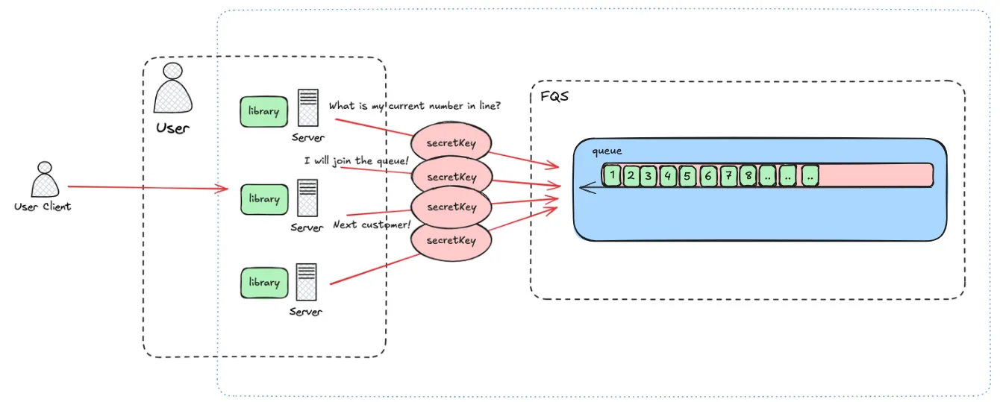
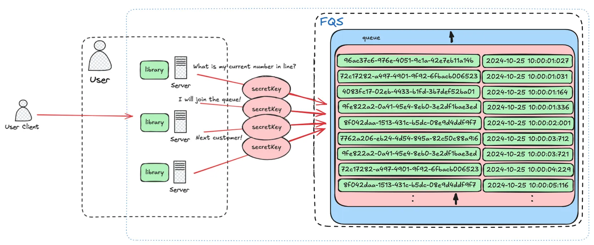

## 🐥FQS

---

- FQS는 대규모 트래픽을 처리할 수 있는 대기열 기능을 제공하는 B2B SaaS 플랫폼입니다.
- "Flexible Queue Service"라는 이름은 대기열 서비스를 사용하는 개발자들에게 유연한 대기열 관리를 제공하는 목표를 반영합니다.

## 🏃‍♂️‍➡️목표

---

- 대규모 트래픽을 경험하는 도메인을 구축하는 개발자들을 대상으로 합니다.
  예를 들어, 티켓팅 시스템 등을 포함합니다.
- 백엔드 개발자들에게 라이브러리 형태로 편리한 대기열 서비스를 제공합니다.

## 👍장점

---




- 대기열 관리를 위한 부하를 처리합니다.
- 사용이 간편한 라이브러리를 제공합니다.
- 루트 권한과 하위 권한 계정을 사용하여 보다 세부적인 관리가 가능합니다.
- FQS 는 동시간 운영되고 있는 타 대기열 서비스 간 독립적인 환경을 제공하기 위해 대기열 별로 별도의 인스턴스를 생성해 제공합니다.

## 🧑‍🏫사용 방법

---

### 1. **회원가입**

회원가입을 위해 다음과 같은 요청을 보냅니다.

```java
   POST "/auth/signup"
```
```java
   //RequestBody
    {
        "groupName": "f4", // 그룹의 이름
        "groupLeaderName": "Gu Jun-pyo", // 그룹 리더의 이름
        "email": "jpgoo@f4.com", // 이메일
        "password": "qwe123!@#" //비밀번호
    }
```
- POST /auth/signup 요청을 통해 회원가입을 진행합니다.
- 요청 본문에 그룹 이름, 그룹 리더 이름, 이메일, 비밀번호를 포함합니다.


### 2. **로그인 하여 인증 토큰 받기**

로그인을 위해 다음과 같은 요청을 보냅니다.

```java
   POST "/auth/login/root"
```

```java
   //RequestBody
    {
    "email": "jpgoo@f4.com",
    "password": "qwe123!@#"
    }
    // 요청을 보낸 후 응답의 헤더에서 Authorization 필드에 있는 토큰을 확인
```

- POST /auth/login/root 요청을 통해 로그인을 합니다.
- 요청 본문에 이메일과 비밀번호를 포함합니다.
- 위 요청을 통해 로그인 후, 응답 헤더의 Authorization 필드에서 토큰을 확인합니다.


### 3. **대기열 생성하기**

대기열을 생성하기 위해 다음과 같은 요청을 보냅니다.

```java
   POST "/api/queue"
```

```java
    //Request Body
    {
        "name": "2024-mama-thai", // 대기열 이름 (needed for queue API calls)
        "messageRetentionPeriod": 9999, // 메시지 보존 기간
        "maxMessageSize": 9999, // 최대 메시지 크기
        "expirationTime": "2024-11-10T12:00:00", // 대기열 만료 시간
        "messageOrderGuaranteed": false, // 순서 보장 여부
        "messageDuplicationAllowed": false // 중복 허용 여부
    }
    // 위 요청 후, 응답에서 발급된 secretKey를 확인
   ```

- POST /api/queue 요청을 통해 대기열을 생성합니다.
- 요청 본문에 대기열 이름, 메시지 보존 기간, 최대 메시지 크기, 대기열 만료 시간, 메시지 순서 보장 여부, 메시지 중복 허용 여부를 포함합니다.
- 위 요청 후, 응답에서 발급된 secretKey를 확인합니다.

## 대기열 서비스
### 4. **대기열 검증하기**
#### 4-0. 대기열 이름과 secretKey가 일치하는지 확인

```java
    GET "/api/queue/validate?queueName={queueName}"
    // 대기열을 생성할 때 사용한 이름을 {queueName}에 입력
```

```java
    // Request Header
    {
        "secretKey" : {secretKey} // 대기열 생성 시 발급된 고유한 secretKey를 요청 헤더에 추가
    }
    // 위 요청 후, 응답에서 발급된 secretKey를 확인
   ```

```java
    // Request Body
   {
           "success": "true", // 요청의 성공 여부
           "data": {
               "userId": "f728287c-2d0b-4fd0-9196-5669269804c3" // 사용자 ID
           }
   }
   ```
- 요청 헤더에 발급된 secretKey를 추가합니다.
- GET /api/queue/validate?queueName={queueName} 요청을 통해
  queueName(대기열 이름)과 secretKey가 일치하는지 확인합니다.
- Boolean 값으로 일치 여부를 받습니다. (일치하면 true, 일치하지 않으면 false)

#### 4-1. 대기열에 티켓 생성하기
대기열에 새로운 티켓을 생성하기 위한 요청입니다.

```java
    POST "/{queueName}/api/queue"
    // 대기열을 생성할 때 사용한 이름을 {queueName}에 입력
```

```java
    // Request Header
    {
        "secretKey" : {secretKey} // 대기열 생성 시 발급된 고유한 secretKey를 요청 헤더에 추가
    }
    // 위 요청 후, 응답에서 발급된 secretKey를 확인
   ```

```java
    //Request Body
    {
            "success": "true", // 요청의 성공 여부
            "data": {
                "userId": "f728287c-2d0b-4fd0-9196-5669269804c3" // 생성된 티켓의 사용자 ID
            }
    }
   ```
- POST /{queueName}/api/queue 요청을 통해 대기열에 티켓을 생성합니다.
- 요청 헤더에 secretKey를 추가합니다.
- 요청 후, 응답에서 생성된 티켓의 고유 문자열(userId)을 확인할 수 있습니다.

#### 4-2. 대기열에서 소비하기
대기열에 새로운 티켓을 생성하기 위한 요청입니다.

```java
    POST "/{queueName}/api/queue/consume?size={size}"
    // 대기열을 생성할 때 사용한 이름을 {queueName}에 입력
    // 소비할 티켓의 수를 {size}에 입력
```

```java
    // Request Header
    {
        "secretKey" : {secretKey} // 대기열 생성 시 발급된 고유한 secretKey를 요청 헤더에 추가
    }
   ```

```java
    //Request Body
    {
            "success": "true", // 요청의 성공 여부
            "data": {
                  "consumes": [
                    "f210f629-db49-493b-9634-67793615e3bb" // 소비된 티켓의 사용자 ID
                  ]
            }
    }
   ```
- POST /{queueName}/api/queue 요청을 통해 대기열에 티켓을 생성합니다.
- 요청 헤더에 secretKey를 추가합니다.
- 요청 후, 응답에서 생성된 티켓의 고유 문자열(userId)을 확인할 수 있습니다.

#### 4-3. 현재 순위 확인하기
특정 티켓의 현재 순위를 확인하기 위한 요청입니다.

```java
    Get "/{queueName}/api/queue/ranks?identifier={numberID}"
    // 대기열을 생성할 때 사용한 이름을 {queueName}에 입력
    // 순위를 확인할 티켓의 고유 ID를 {numberID}에 입력
```

```java
    // Request Header
    {
        "secretKey" : {secretKey} // 대기열 생성 시 발급된 고유한 secretKey를 요청 헤더에 추가
    }
   ```

```java
    //Request Body
    {
            "success": "true", // 요청의 성공여부
            "data": {
                "rank": 7 // 티켓의 현재 순위 (예시에서는 순위가 7)
            }
    }
   ```
- GET /{queueName}/api/queue/ranks?identifier={numberID} 요청을 통해 특정 티켓(numberID)의 현재 순위를 확인합니다.
- 요청 헤더에 secretKey를 추가합니다. 추가 후 요청하면, 티켓의 현재 순위를 알 수 있습니다.
- 응답에서 티켓의 현재 순위를 확인합니다.
